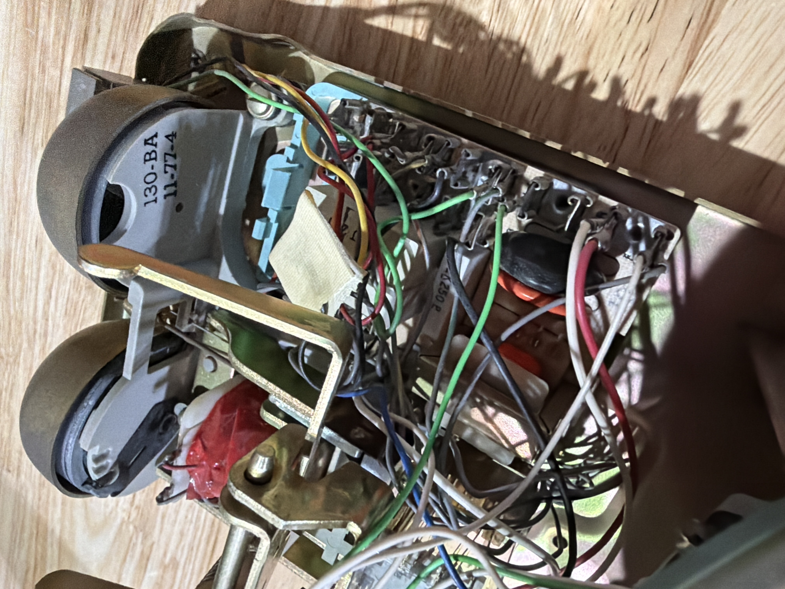
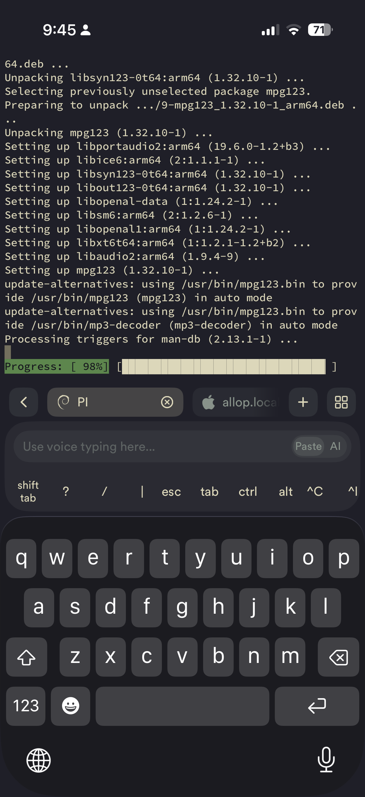

# HelloHistory

I had a vision for something I didn't know how to build. Two weeks later, I'd built it—and learned things along the way I'll carry into whatever comes next.

The project: a 1960s rotary phone at the Del Monte house, a mid-century modern rental in Washington State. It's a little easter egg for curious guests. Pick up the handset and you hear the story of Mary Lund Davis, the architect who designed the house in 1954. Hang up and it stops. No instructions, no prompts—just a small surprise for people who notice.

---

## The Vision

The house was designed by Mary Lund Davis, the first licensed female architect in Washington State after WWII. Guests often ask about its history. I wanted a way to tell her story that matched the character of the space—something that felt intentional, not bolted on.

A rotary phone made sense. Pick it up, listen. No screens, no instructions. The gesture is self-explanatory.

As a designer, I also wanted to express something of myself: modifying an old piece of technology with something at the edge of innovation, crafting an artifact that creates a small moment of magic.

I knew what I wanted. I had no idea how to make it.

## What I Didn't Know

I'd never configured a Raspberry Pi. I didn't know what GPIO meant. I didn't know how rotary phones were wired internally.

What I had was Amplifier—and a clear picture of what the end result should be.

## The Source Material

Mary Lund Davis is well known for her contributions to Pacific Northwest modernism. Being part of this history was a privilege.

The primary source was [*Mary Lund Davis: A Portrait in Three Histories*](https://digital.lib.washington.edu/researchworks/items/75e69ac3-bc19-41fa-9c6e-ae27d7ab16d6), a thesis by Nevis Granum, Mary's grandson. We were fortunate to find it—a remarkable document, part architectural history, part family memoir, that lets you understand her thinking and expression. That's what makes history human. We also drew from articles, archives, and records of her later work.

The thesis was a beautiful read. The challenge was condensing it into something suited for the experience—a few minutes through a phone handset. With Amplifier, I worked through the material: what mattered most, what would resonate, how to structure it. We built a knowledge base, shaped the scripts, iterated on tone. Seven chapters, about twelve minutes total.

## Building It

**Hardware setup.** I described what I wanted to Amplifier: a phone that plays audio when lifted and stops when hung up. It gave me a concrete plan—Raspberry Pi, GPIO for the hook switch, USB audio adapter. A shopping list with links. Why Pi over Arduino. I didn't research any of this. I described the destination and got a map.

**First boot.** Amplifier walked me through flashing the OS, configuring WiFi and SSH during imaging so the device would be headless from the start. First connection attempt failed. We debugged together—wrong network, hostname not resolving—until it worked. Then it set up a development workflow before I even asked: `make deploy`, `make logs`, `make restart`. A bench version for testing on my Mac. The infrastructure I didn't know I needed.

**The wiring.** I opened the phone and found seven unlabeled wires on the hook switch. Gray, yellow, orange, two whites, a brown. No documentation.

Amplifier explained how hook switches work, wrote a GPIO test script, and deployed it to my Pi—not sent me code to copy, but actually SSH'd in and ran it. I stood there holding wires while it iterated. We tested combinations until we found it—yellow triggered on handset lift. That's the difference: I was physically debugging hardware while the AI deployed code in real-time. With ChatGPT, I'd be copying code, pasting into a terminal, running it, copying output back. Minutes per iteration instead of seconds.

**The speaker.** I'd planned to use an external speaker, but the phone had its original earpiece. Amplifier explained the considerations—impedance, power—and said it was worth trying. I wired it with lever nuts. It worked. The sound is a little vintage, a little imperfect. Exactly right.

**The bugs.** Audio disappeared after reboots. Linux kept choosing the wrong sound card. Dependencies were missing. Each issue was found and fixed in minutes—Amplifier would SSH in, check `journalctl`, spot the problem, edit the config, restart the service, and confirm the fix. Not tell me what commands to run. Actually run them.

**Production.** Amplifier created a systemd service, installation script, and Makefile command. One command: `make setup-service`. Now the phone boots, starts the listener, and waits.

## What Made This Work

I had a vision I couldn't execute on my own. Amplifier made it possible—and I want to be specific about why.

**It executed, not just advised.** This is the core difference. ChatGPT can tell you how to configure a systemd service. Amplifier SSH'd into my Pi and configured it. When I was holding wires, it deployed test scripts in real-time. When audio broke, it checked logs and fixed configs while I watched. Cursor and Copilot are great for code completion, but they can't reach into a device on your network and debug it with you.

**It worked across domains.** Research, writing, audio, Python, Linux, hardware debugging—all in one continuous context. I wasn't switching between ChatGPT for research, Cursor for code, and a terminal for deployment. The AI knew the whole project, from Mary's biography to the GPIO pin numbers.

**It built the scaffolding.** Deploy scripts, Makefiles, service configurations. Not because I asked for them—because it understood they were necessary. The infrastructure that makes a project maintainable.

Amplifier took my vision and helped me see it through. I learned along the way—about GPIO, about Linux services, about how old phones are wired. And this isn't one and done. I'll keep iterating on it, and I have the confidence now to take on things I wouldn't have tried before. That's what good technology should do. That's what useful AI is meant to unlock.

## The Result

A vintage rotary phone that plays 12 minutes of narration about Mary Lund Davis, uses the original 1960s earpiece, starts automatically on power-on, and can be updated remotely.

Built in two weeks by someone who'd never configured a Raspberry Pi.

---

## The Property

The phone lives at the Del Monte house, a mid-century modern rental in Washington State. [midcenturypnw](https://linktr.ee/midcenturypnw)

## About Amplifier

Amplifier is an open-source AI agent framework from the Research Team at Microsoft. Unlike chat-based AI tools, it takes actions—writes files, runs commands, deploys code, debugs in real-time.

[github.com/microsoft/amplifier](https://github.com/microsoft/amplifier)

---

*Source: [github.com/anderlpz/HelloHistory](https://github.com/anderlpz/HelloHistory)*

*Disclosure: I'm a member of the Amplifier team at Microsoft.*
